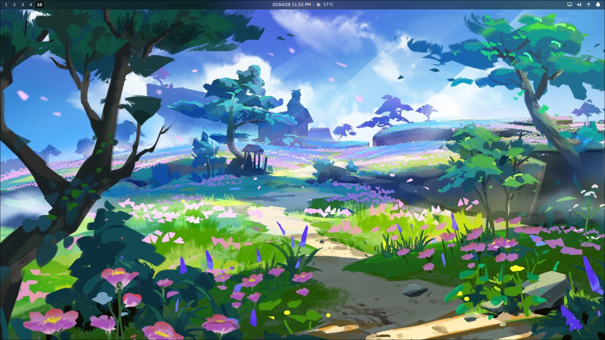
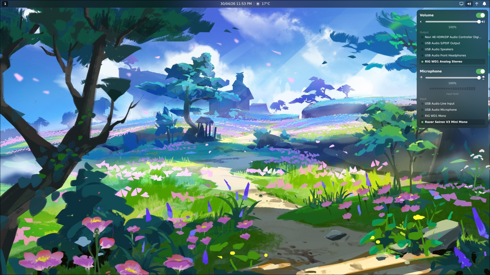
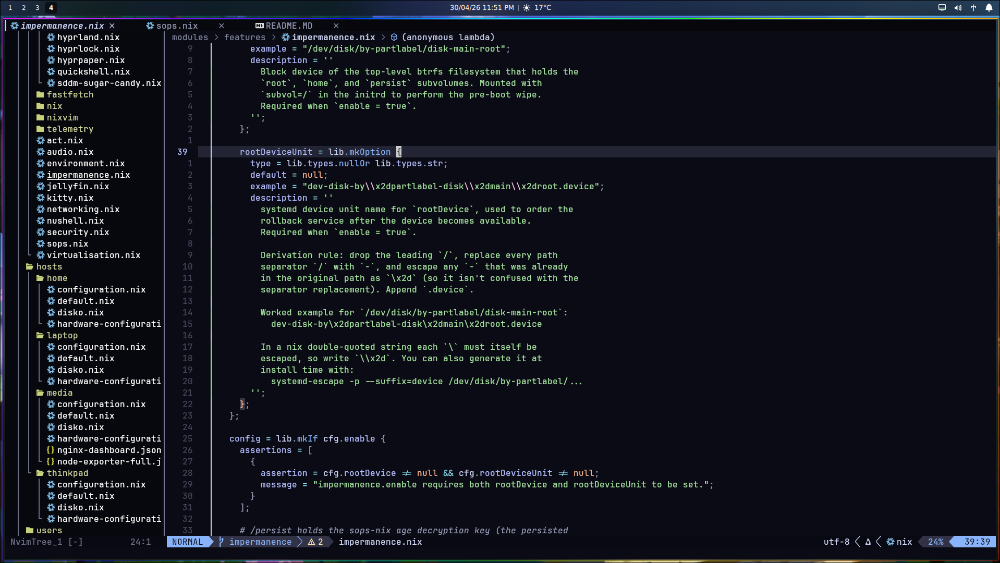

# Keanu Ashwell's NixOS Configuration

<div align="center">
	
	
	
</div>
<br>

# Sops

Secrets are managed with [sops-nix](https://github.com/Mic92/sops-nix) using age encryption. Each machine's SSH host key is converted to an age key for decryption, plus an admin age key for manual operations.

## Commands

```bash
# Edit encrypted secrets
nix-shell -p sops age --run 'sops secrets/secrets.yaml'

# Verify decryption works
nix-shell -p sops age --run 'sops --decrypt secrets/secrets.yaml'

# Get a machine's age public key
nix-shell -p ssh-to-age --run 'cat /etc/ssh/ssh_host_ed25519_key.pub | ssh-to-age'

# Re-encryption
nix-shell -p sops age --run 'sops updatekeys secrets/secrets.yaml'
```

## Adding a new machine

1. Get its age public key: `nix-shell -p ssh-to-age --run 'cat /etc/ssh/ssh_host_ed25519_key.pub | ssh-to-age'`
2. Add the key to `.sops.yaml` under `keys` and in `creation_rules`
3. Re-encrypt: `nix-shell -p sops age --run 'sops updatekeys secrets/secrets.yaml'`
4. Add the host's SSH keys: `nix-shell -p sops age --run 'sops secrets/secrets.yaml'`
5. Import `self.nixosModules.sops` in the new host's configuration

# Nixos Anywhere

Because every host uses impermanence + sops-nix, `/persist` needs the sops age key and ed25519 host key seeded prior to first activation — otherwise sops can't decrypt and `keanu_password` never materialises. `deploy-host` (defined in `modules/deploy.nix`) stages those files from the key USB and invokes `nixos-anywhere --extra-files` in one step.

## Usage

On the target: boot the NixOS minimal installer ISO and set a root password (`sudo passwd root` in the installer console). This is required because `nixos-anywhere` runs as root for disko/install; the installer's `nixos` user isn't a workable substitute.

On the deploy machine, with the key USB mounted:

```bash
nix run .#deploy-host -- --host laptop --ip 192.168.1.6
```

Type the root password when `ssh-copy-id` prompts you

### Flags

- `--host <name>` — host attr in `flake.nixosConfigurations` (`home`, `laptop`, `thinkpad`, `media`).
- `--ip <addr>` — target IP or hostname. Connection is always made as `root`.
- `--path <usb-root>` — USB root path. Defaults to the first directory under `/run/media/$USER`.

Expected USB layout (same as the `install-host` ISO installer):

```
<usb-root>/sops/admin/keys.txt
<usb-root>/sops/<host>/ssh_host_ed25519_key
<usb-root>/sops/<host>/ssh_host_ed25519_key.pub
```
